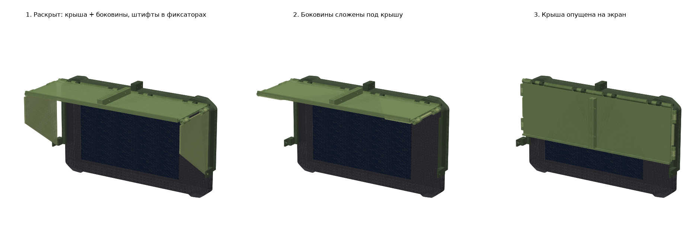
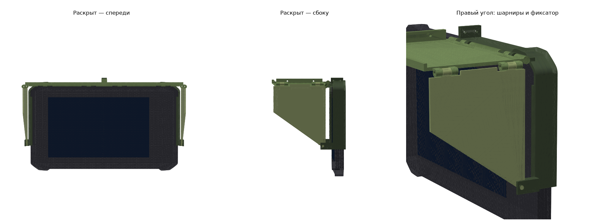

# Складной козырёк для Lowrance Elite FS 9




## Механизм

- **Рейка** — С-образный захват за кромку передней рамки. Надевается сверху вниз, как козырёк
  [Printables 931877](https://www.printables.com/model/931877): задняя закраина заходит за рамку на 6 мм,
  по бокам передняя закраина — на 3.5 мм. На рейке шарнир крыши и внизу каждого бока фиксатор с отверстием.
- **Крыша** (вылет 100 мм) на шарнире перед верхней кромкой рамки. Складывается вниз на экран.
- **Боковины** на шарнирах по краям крыши. Раскрытые, они висят вниз, штифт на боковине входит
  в отверстие фиксатора, и крыша заперта в обе стороны. Сложенные, лежат под крышей.
- Порядок: крышу поднять, опустить боковины (штифт щёлкает в фиксатор). Закрыть: боковины внутрь, крышу вниз.

Каждая деталь — две зеркальные половины, стянутые по центру.

## Размеры рамки (откуда)

Контур рамки — `fs9_template_geometry.json`, вытащен из векторов официального шаблона Lowrance
«Elite FS-9 Mounting Template» 988-12762-001 (1:1): рамка 289 × 170.5 мм, прямая кромка ±81.8 от центра,
угловые плечи выше на 3.4 мм. Толщина кромки и посадка закраин сняты с козырька Printables 931877.

## Метизы

- шарниры: 8 × M3×25 + гайка с нейлоном (4 крыша–рейка, 4 боковины–крыша)
- стыки половин: 4 × M3×12 + гайка

## Пересобрать

```
uv run --with build123d --with shapely python fs9_visor.py          # STL + STEP в out/
uv run --with trimesh --with numpy --with manifold3d --with scipy --with networkx --with shapely python check.py   # столкновения при складывании
uv run --with trimesh --with numpy --with matplotlib --with shapely --with manifold3d --with scipy --with networkx python render.py
```

Параметры (вылет крыши `D`, высота боковин, зазоры) — в начале `fs9_visor.py`.
`fs9_visor_open.step` — все шесть деталей в раскрытом положении, открывается во Fusion.

## Не проверено на железе

Глубина корпуса в инструкции Lowrance противоречива (16.5 + 91.9 ≠ 118.4); на козырёк не влияет,
но толщину кромки рамки (~15 мм) и положение кнопок стоит сверить на живом эхолоте.
