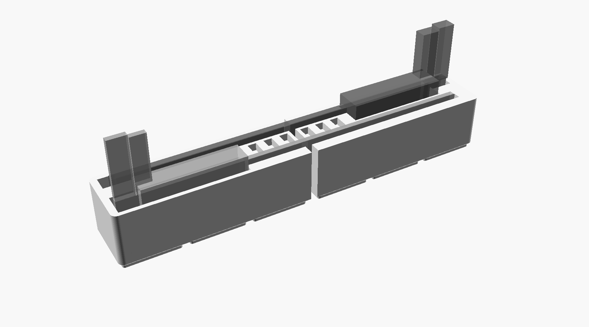
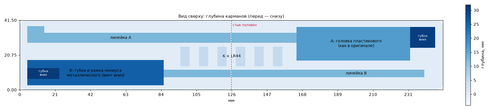

# Gridfinity 6×1: два штангенциркуля и 6 батареек LR44




Та же деталь на build123d лежит в [b123d/](b123d/README.md). Там есть STEP, проверка толщины
стенок и пределы, до которых можно поднять размеры металлического после замера.

По мотивам [MakerWorld 1013744](https://makerworld.com/en/models/1013744-gridfinity-1x6-6-calipers-holder-6-lr44-battery)
(tej, CC BY-NC 4.0). У автора бин 1×6 под один пластиковый электронный штангенциркуль.
Здесь в ту же ширину одной клетки легли два:

- **A — пластиковый электронный**, сзади, головка справа. Карманы сняты с авторского 3MF 1:1:
  паз линейки 6.1 мм, головка 67.5 × 20, паз внутренних губок 15 × 12.5 глубиной 30 мм.
  Автор делал под Sangabery 0–6" длиной 240 мм, в отзывах он подходит и к другим пластиковым.
- **B — обычный металлический**, спереди, головка слева. Размеры типового 150-мм нониуса.
  **Это черновик до замера**, см. ниже.
- **6 гнёзд LR44** — один ряд посередине, между линейками.

Оба лежат как в оригинале: на ребре, наружные губки вверх и служат ручкой. Внутренние губки
и стопорный винт металлического уходят вниз, в глубокий карман. Так под винт место есть
сразу: в оригинале его не было, и в отзывах на это жаловались.

## Почему 6×1, а не 6×2

Головки положены в разные стороны. Тогда рядом с широкой головкой одного проходит только
тонкая линейка другого, и оба помещаются в 41.5 мм. Самая тонкая стенка — около 2 мм,
между гнёздами батареек и пазами. Выреза под палец, как у автора, нет. В одной клетке ему
некуда встать, и штангенциркуль берётся за губки: они торчат над бином на 4–5 см.

## Две половины 3×1

Цельный бин 251.5 мм на стол A1 mini (180 мм) не входит. `left.stl` и `right.stl` — каждая
полноценный бин 3×1 со своим зазором на линии сетки. Встык их держит сетка основания, клея
и шипов нет. Стык приходится на стенку между 3-й и 4-й батарейкой. Обе половины встают на
один стол рядом. Печать дном на стол, без поддержек. Гнёзда под магниты 6×2 включены,
выключаются параметром `magnets`.

## Что померить у металлического

| Что | Параметр | Сейчас |
| --- | --- | --- |
| длина закрытого, от губок до конца линейки | `b_len` | 235 |
| толщина линейки | `b_beam_t` | 3.5 |
| на сколько внутренние губки выступают за кромку линейки | `b_inner_jaw` | 17 |
| длина неподвижной губки вместе с рамкой нониуса | `b_head_len` | 80 |
| толщина рамки: от середины линейки вперёд (шкала) и назад | `b_head_front`, `b_head_back` | 6.5, 7.5 |
| на сколько рамка со стопорным винтом выступает за кромку линейки со стороны внутренних губок | `b_below` | 12 |

Зазоры (`cl_slot`, `cl_len`, `cl_depth` — по 1 мм) добавляются к этим числам сами.
Пластиковый стоит проверить только длиной: у автора 240 мм, паз вмещает 242.

## Пересобрать

```
"/Applications/OpenSCAD Dev.app/Contents/MacOS/OpenSCAD" -o left.stl -D 'part="left"' holder.scad
"/Applications/OpenSCAD Dev.app/Contents/MacOS/OpenSCAD" -o right.stl -D 'part="right"' holder.scad
```

`openscad` из Homebrew на этом Маке падает с кодом 137 и файла не пишет — собирать бинарником из OpenSCAD Dev.app.

Превью со штангенциркулями-призраками — открыть `holder.scad` в OpenSCAD (`part = "both"`).
Проверено на OpenSCAD 2026.09.12.

## Не проверено на железе

Ни одна половина ещё не напечатана. Металлический построен по типовым размерам, пластиковый — по карманам оригинала.
