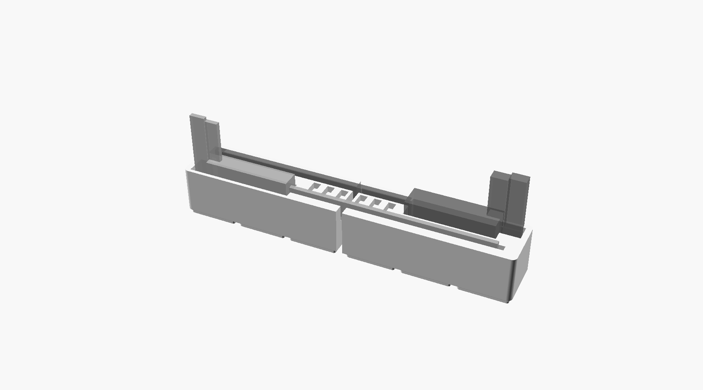

# Gridfinity 6×1 под два штангенциркуля: версия build123d



Это та же деталь, что `../holder.scad`, построенная заново в build123d скиллом `b123d-modeling`
через build123d-mcp. Раскладка, зачем 6×1 и почему две половины, описаны в [../README.md](../README.md).

Идею скилл не поменял ни на миллиметр. Половины весят 158 397.1 и 164 374.3 мм³, а у OpenSCAD
было 158 397.2 и 164 374.4. Разница в 2.3 мм³ на половину целиком приходится на огранку: SCAD
строил скругления углов и гнёзда магнитов многоугольниками `$fn=48`, здесь они точные дуги.

## Что добавила сборка через скилл

- **`holder.step`** с точной геометрией, его можно открыть во Fusion. SCAD-версия давала только STL.
- **Толщины стенок посчитаны, а не прикинуты.** Самые тонкие, 2.09 мм, стоят между гнёздами LR44
  и пазами обеих линеек. Передняя стенка у рамки металлического 2.75, задняя у конца линейки
  пластикового 3.57. От гнезда LR44 до стыка половин 2.37, дно над магнитами 7.1.
  Скрипт проверяет стенки сам: если любая окажется тоньше `MIN_WALL = 1.6` мм (4 линии сопла 0.4),
  сборка падает и называет эту стенку.
- **Посадка проверена пересечением** с призраками штангенциркулей: они не врезаются в бин (0 мм³).
  Боковой зазор у пластикового 0.435 мм, у металлического 0.5.
- **Печатаемость** (augura): обе половины влезают на стол 180 мм, тонких стенок нет. Анализ помечает
  «потолки»: гнёзда магнитов (мост 6.5 мм), щели 0.5 мм между ножками и два угла на стыке по 3 мм².
  Корпус на стыке обрезан под прямым углом, а ножка под ним скруглена R3.75, так что угол свисает
  до 1.5 мм по диагонали. В SCAD-версии эта геометрия та же.

## До каких размеров можно поднять после замера

Металлический построен по типовым размерам, таблица «что померить» есть в [../README.md](../README.md).
Ниже для каждого размера посчитан предел, до которого раскладку можно не трогать. Предел найден
бисекцией по самой модели: выше него какая-то стенка становится тоньше 1.6 мм.

| Параметр | Сейчас | Можно до | Во что упирается |
| --- | --- | --- | --- |
| `B_HEAD_FRONT`: рамка от середины линейки вперёд | 6.5 | **7.6** | передняя стенка, мерить первым |
| `B_INNER_JAW`: внутренние губки вниз | 17 | 22.5 | гнездо магнита под ними |
| `B_BEAM_T`: толщина линейки | 3.5 | 5.5 | ряд LR44 (он центрируется между пазами) |
| `B_LEN`: длина закрытого | 235 | 244.4 | торцевая стенка |
| `B_HEAD_LEN`: губка + рамка по длине | 80 | 88.2 | первое гнездо LR44 |
| `B_BELOW`: рамка с винтом ниже кромки линейки | 12 | 20.1 | дно между ножками |
| `B_HEAD_BACK`: рамка назад | 7.5 | 16.1 | паз пластикового |
| `B_JAW_T`: толщина внутренних губок | 3.5 | 13.3 | передняя стенка |
| `B_JAWS_X`: внутренние губки по длине | 18 | 88.7 | первое гнездо LR44 |
| `A_SLOT_LEN`: паз пластикового по длине | 242.5 | 245.4 | торцевая стенка |
| `A_HEAD_LEN`: карман головки пластикового | 82.5 | 89.3 | шестое гнездо LR44 |

Если размер выходит за предел, нужно двигать соседа: `B_Y`, `A_Y` или `BAT_X0`. Скрипт покажет,
какая стенка не прошла.

## Пересобрать

```
uv run --with build123d python holder.py
```

Запускать из этой папки. Скрипт пишет `left.stl`, `right.stl` и `holder.step`, сборка занимает около 10 с.
Каждый параметр стоит на отдельной строке, потому что `design_audit` из build123d-mcp не видит
параметры, заданные кортежем.

## Не проверено на железе

Как и SCAD-версия: ни одна половина ещё не напечатана, металлический построен до замера.
