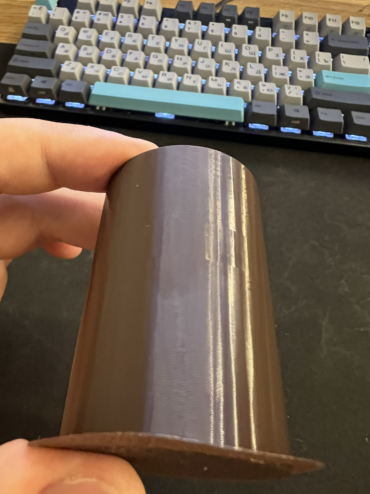

# 2026-09-22 — калибровка SUNLU PETG Olive Green

Катушка печаталась с 21.09 на пустом клоне `Generic PETG @BBL A1M` (255 °C, поток 0.95, MVS 8) — ни одно значение не проверялось. Поводом стали мелкие нитки на решётке телевизора; Дима спросил, отчего они, и решил калибровать.

## Что сделано

| Шаг | Стол | Время | Результат |
| --- | --- | --- | --- |
| Температура | `bbs_calib.py temp … 255 220`, 8 блоков по 10 мм, самый горячий внизу | 1:26, 14.5 г | **245 °C** |
| Поток, тонкий проход | `bbs_calib.py flow2 … 0.99`, 10 блоков −9…0 % | 0:33, 13.5 г | **0.95** |
| Предел расхода | `bbs_calib.py speed … 5 20` + `speed-ramp`, цилиндр ⌀40 × 60 | 0:14, 4.2 г | **16 мм³/с** |

Грубый проход по потоку пропущен: правило справочника — он нужен только для первой линейки марки, а SUNLU PLA и Matte уже калиброваны.

**Температура.** 220 и 225 — низ козырьков рваный, недоэкструзия на скоростях пресета (башня печатается на скоростях процесса, холодные блоки не успевают плавиться). 250 и особенно 255 — появляется блеск и волнистость стенки. Чисто 230–245, по правилу «верхняя граница приемлемого» → 245. Надстройку 265 → 250 не печатали: раз на 255 уже видно подтекание, выше смысла нет. **Нитки одинаковы на всех восьми блоках** — значит, к температуре отношения не имеют; кандидаты ретракт и влага, ни то ни другое не проверялось.

**Поток.** Дима выбрал блок −4: `0.99 × 0.96 = 0.950`. Совпало с дефолтом `Generic PETG` — заводская догадка для этой катушки оказалась точной. У −3 и правее появляется глянцевая волна, у −5 и левее проступают бороздки.

**Предел расхода: дефекта не нашли.** Цилиндр печатался с нарастанием 5 → 20 мм³/с по формуле `flow(h) = 5 + 15 × (h − 0.4) / 59.6`. Стенка осталась глянцевой и ровной до самого верха: ни рвани, ни матовых провалов, ни утончения. Значит потолок катушки выше 20, а 20 — всё, что помещается в файл: Studio молча не грузит `.gcode.3mf` с расходом выше ~26 мм³/с. В пресет записаны **16** — двадцать процентов запаса от проверенного максимума, нижний край правила «минус 10–20 % от первого дефекта». Запас есть, если понадобится.

Единственное, что видно на цилиндре, — гранёность стенки в верхней половине: голова идёт многоугольником, а не окружностью. Это свойство тестового объекта, а не пластика: цилиндр генерится с конечным числом сегментов, и чем выше, тем быстрее печать (238 мм/с в верхней точке), тем заметнее замедление на каждом угле. К расходу отношения не имеет.

Цена вопроса, замерено дважды. На крышке при пресетных 8 мм³/с: потолок даёт на стенке 0.42 × 0.2 ровно 95 мм/с, и весь файл печатался на 96–103 мм/с при прописанных в процессе 200 на наружной стенке и 300 на внутренней. На столе щёчек после записи 16 в пресет:

| | MVS 8 | MVS 16 |
| --- | --- | --- |
| наружная стенка | 99 мм/с | 181 мм/с |
| внутренняя стенка | 97 | 193 |
| разрежённое заполнение | 98 | 197 |
| сплошное заполнение | 107 | 213 |
| время стола | 8:33 | **6:33** |

Два часа на одном столе, пластика ровно столько же — 199.3 г.

## Пресет

`profiles/user/SUNLU PETG Olive Green @BBL A1M.json` — `nozzle_temperature` 245 (и первый слой), `filament_flow_ratio` 0.95, `filament_max_volumetric_speed` 16, наследует `Generic PETG @BBL A1M`. Записан и в сам пресет Studio (`user/<id>/filament/`) 22.09 вечером.

**Почему это чуть не потерялось.** Сутки пресет в Studio оставался пустым клоном: имя, `inherits` и больше ничего. На печати это не сказывалось, потому что `variant` зашивает значения в каждый проект и перечисляет их в `different_settings_to_system`, так что G-code уезжал правильный. Но любая сессия, которая спрашивает у Studio «какие филаменты откалиброваны», честно отвечала «PETG нет».

Ловушка тут в родителе. Studio хранит в пользовательском пресете **только то, что отличается от родителя**, и у откалиброванных PLA это незаметно: `SUNLU PLA @BBL A1M` наследует `SUNLU PLA+ @BBL A1M`, где температура и предел расхода уже свои, поэтому в файле лежит один `filament_flow_ratio 0.98` и этого достаточно. У PETG родитель — `Generic PETG @BBL A1M`, дженерик, и там **каждое значение обязано лежать явно**. Пустой файл для PETG значит «не калиброван», а для PLA то же самое значило бы «всё в родителе».

`filament_max_volumetric_speed` 16 — единственное значение, взятое с запасом, а не по замеру: дефект не наступил.
